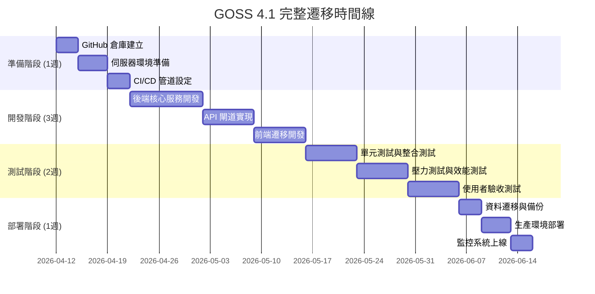

# 🚀 GOSS 4.1 完整重構方案

## 📋 專案概述

### 專案目標
- **解決現有問題**: 資料同步延遲、多層傳輸瓶頸、錯誤處理不足
- **技術現代化**: 採用現代技術棧，提升系統可維護性
- **效能優化**: 實現真正的即時資料處理
- **擴展性**: 為未來功能擴展預留空間

## 🏗️ 系統架構設計

### 4.1 架構概覽
```
GOSS 4.1 三層架構：
┌─────────────────┐    ┌─────────────────┐    ┌─────────────────┐
│   前端層         │    │    API 閘道層    │    │   後端服務層     │
│   (Next.js)     │◄──►│   (FastAPI)     │◄──►│   (微服務)      │
│                 │    │                 │    │                 │
│ - 即時UI更新     │    │ - 請求路由      │    │ - 資料收集      │
│ - WebSocket     │    │ - 認證授權      │    │ - 資料處理      │
│ - 狀態管理      │    │ - 快取管理      │    │ - 資料存儲      │
└─────────────────┘    └─────────────────┘    └─────────────────┘
```

### 4.2 技術棧選擇
```yaml
前端層:
  - 框架: Next.js 14 (App Router)
  - 狀態管理: Zustand (輕量級)
  - 即時通訊: WebSocket + Server-Sent Events
  - UI 組件: Shadcn/ui + Tailwind CSS

API 閘道層:
  - 框架: FastAPI (Python)
  - 資料庫: PostgreSQL (主) + Redis (快取)
  - 訊息佇列: Celery + Redis
  - 認證: JWT + OAuth2

後端服務層:
  - 資料收集: 微服務架構
  - 資料處理: Python + Pandas
  - 即時計算: Apache Kafka (可選)
  - 監控: Prometheus + Grafana
```

## 🔄 資料流重設計

### 4.3 簡化資料流程
```
舊流程 (5層):
資料源 → 後端DB → 伺服器API → CDN → 前端API → 前端頁面

新流程 (3層):
資料源 → 後端服務 → API閘道 → 前端頁面
        ↕              ↕
       Redis快取     WebSocket推送
```

### 4.4 即時資料處理
```python
# 新的資料處理架構
class RealTimeDataProcessor:
    def __init__(self):
        self.websocket_manager = WebSocketManager()
        self.cache = RedisCache()
        self.data_sources = {
            'opensky': OpenSkyService(),
            'flightaware': FlightAwareService(),
            'adsb': ADSBServerService()
        }
    
    async def process_data(self, source, data):
        # 即時處理並推送
        processed = await self.process_data_in_realtime(data)
        await self.websocket_manager.broadcast(processed)
        await self.cache.update_cache(processed)
```

## 📁 專案目錄結構

### 4.5 GOSS 4.1 目錄規劃
```
goss-4.1/
├── frontend/                 # Next.js 前端
│   ├── app/
│   ├── components/
│   ├── lib/
│   └── public/
├── backend/                  # FastAPI 後端
│   ├── api/
│   ├── core/
│   ├── services/
│   └── models/
├── data-processor/           # 資料處理微服務
│   ├── collectors/
│   ├── processors/
│   └── exporters/
├── infrastructure/           # 基礎設施
│   ├── docker/
│   ├── k8s/
│   └── monitoring/
└── docs/                    # 文件
    ├── architecture/
    ├── api/
    └── deployment/
```

## 🔧 核心功能模組

### 4.6 微服務架構設計
```python
# 服務模組劃分
services = {
    'flight-tracker': FlightTrackerService(),      # 航班追蹤
    'schedule-processor': ScheduleProcessor(),     # 班表處理
    'gate-assigner': GateAssignerService(),        # 機坪分配
    'alert-manager': AlertManagerService(),        # 警報管理
    'analytics-engine': AnalyticsEngineService(),  # 分析引擎
}
```

### 4.7 即時通訊機制
```typescript
// 前端 WebSocket 連接管理
class RealTimeClient {
    private ws: WebSocket;
    private reconnectAttempts = 0;
    
    constructor() {
        this.connect();
    }
    
    private connect() {
        this.ws = new WebSocket('wss://api.goss4.1/ws');
        this.ws.onmessage = this.handleMessage;
        this.ws.onclose = this.handleReconnect;
    }
    
    private handleMessage = (event: MessageEvent) => {
        const data = JSON.parse(event.data);
        // 即時更新 UI
        this.updateUI(data);
    };
}
```

## 🚀 效能優化策略

### 4.8 快取策略
```yaml
快取層級:
  L1: 記憶體快取 (Redis) - 毫秒級回應
  L2: 資料庫快取 (PostgreSQL) - 秒級回應
  L3: CDN 快取 - 分鐘級靜態資源

快取失效策略:
  - 航班資料: 30秒自動失效
  - 班表資料: 5分鐘手動更新
  - 靜態資源: 1小時版本控制
```

### 4.9 負載均衡設計
```python
# API 閘道負載均衡
@app.middleware("http")
async def load_balancer(request: Request, call_next):
    service_name = get_service_from_path(request.url.path)
    healthy_instances = await health_checker.get_healthy_instances(service_name)
    
    if healthy_instances:
        instance = load_balancer.select_instance(healthy_instances)
        request.url = f"{instance.url}{request.url.path}"
    
    response = await call_next(request)
    return response
```

## 🔒 安全與監控

### 4.10 安全架構
```python
# JWT 認證中間件
@app.middleware("http")
async def authenticate(request: Request, call_next):
    token = request.headers.get("Authorization")
    if token:
        user = await jwt_verifier.verify_token(token)
        request.state.user = user
    
    response = await call_next(request)
    return response
```

### 4.11 監控系統
```yaml
監控指標:
  - API 回應時間: < 100ms
  - 資料更新延遲: < 1秒
  - 系統可用性: > 99.9%
  - 錯誤率: < 0.1%

告警規則:
  - 資料源離線: 立即告警
  - 回應時間超標: 5分鐘內告警
  - 記憶體使用率: >80% 告警
```

## 📋 詳細遷移檢查清單

### 第一階段：準備階段檢查清單

#### 1.1 環境準備檢查
```
✅ 伺服器環境檢查
- [ ] 確認 i5 伺服器 (192.168.31.19) 狀態
- [ ] 確認樹莓派 (192.168.31.221) 狀態  
- [ ] 檢查磁碟空間 (至少 50GB 可用)
- [ ] 確認網路連線穩定性
- [ ] 檢查系統資源 (CPU/記憶體使用率)

✅ 軟體依賴檢查
- [ ] Docker 安裝狀態
- [ ] Docker Compose 版本
- [ ] Python 3.11+ 環境
- [ ] Node.js 18+ 環境
- [ ] PostgreSQL 15 可用性
- [ ] Redis 7 可用性
```

#### 1.2 資料備份檢查
```
✅ 資料庫備份
- [ ] goss_v4.db 完整備份
- [ ] 資料庫結構匯出
- [ ] 重要表格資料匯出 (flights, aircraft, schedules)
- [ ] 備份驗證 (檔案完整性檢查)

✅ 設定檔備份
- [ ] API 金鑰設定備份
- [ ] 伺服器設定檔備份
- [ ] SSH 金鑰備份
- [ ] 系統設定備份

✅ 應用程式備份
- [ ] 現有 Python 腳本備份
- [ ] 前端程式碼備份
- [ ] 設定檔備份
- [ ] 日誌檔案備份
```

### 第二階段：基礎設施檢查清單

#### 2.1 GitHub 倉庫設定檢查
```
✅ 倉庫建立檢查
- [ ] 建立 tpe-goss-4.1 倉庫
- [ ] 設定分支保護規則
- [ ] 配置 CODEOWNERS 檔案
- [ ] 設定 issue 模板
- [ ] 配置 PR 模板

✅ CI/CD 管道檢查
- [ ] 測試管道設定
- [ ] 建置管道設定
- [ ] 部署管道設定
- [ ] 安全掃描管道
- [ ] 程式碼品質檢查
```

#### 2.2 Docker 環境檢查
```
✅ 容器配置檢查
- [ ] Dockerfile 正確性檢查
- [ ] docker-compose.yml 配置檢查
- [ ] 環境變數管理
- [ ] 網路配置檢查
- [ ] 儲存卷配置檢查

✅ 服務連線檢查
- [ ] PostgreSQL 容器連線測試
- [ ] Redis 容器連線測試
- [ ] 後端服務連線測試
- [ ] 前端服務連線測試
- [ ] 服務發現機制檢查
```

### 第三階段：資料遷移檢查清單

#### 3.1 資料庫遷移檢查
```
✅ 結構遷移檢查
- [ ] SQLite → PostgreSQL 結構對照表
- [ ] 資料類型轉換驗證
- [ ] 索引遷移檢查
- [ ] 約束條件遷移檢查
- [ ] 觸發器遷移檢查

✅ 資料遷移檢查
- [ ] 批次遷移腳本測試
- [ ] 資料完整性驗證
- [ ] 效能基準測試
- [ ] 錯誤處理機制檢查
- [ ] 回滾機制測試
```

#### 3.2 資料驗證檢查
```
✅ 資料一致性檢查
- [ ] 記錄數量比對
- [ ] 關鍵欄位驗證
- [ ] 時間戳正確性檢查
- [ ] 關聯完整性檢查
- [ ] 業務邏輯驗證

✅ 效能驗證檢查
- [ ] 查詢回應時間測試
- [ ] 併發處理能力測試
- [ ] 記憶體使用率監控
- [ ] 磁碟 I/O 效能測試
```

### 第四階段：服務遷移檢查清單

#### 4.1 後端服務遷移檢查
```
✅ 核心服務檢查
- [ ] 航班追蹤服務遷移
- [ ] 資料處理服務遷移
- [ ] API 閘道服務遷移
- [ ] 認證服務遷移
- [ ] 監控服務遷移

✅ 功能完整性檢查
- [ ] ADS-B 資料接收功能
- [ ] OpenSky API 整合功能
- [ ] FlightAware API 整合功能
- [ ] 班表處理功能
- [ ] 機坪分配功能
```

#### 4.2 前端服務遷移檢查
```
✅ 頁面遷移檢查
- [ ] 首頁航班顯示功能
- [ ] 班表頁面功能
- [ ] 離場頁面功能
- [ ] 地圖頁面功能
- [ ] 回饋頁面功能

✅ 互動功能檢查
- [ ] 即時資料更新功能
- [ ] 搜尋過濾功能
- [ ] 排序功能
- [ ] 響應式設計檢查
- [ ] 錯誤處理機制
```

### 第五階段：整合測試檢查清單

#### 5.1 功能測試檢查
```
✅ 單元測試檢查
- [ ] 後端服務單元測試覆蓋率 >80%
- [ ] 前端組件單元測試覆蓋率 >70%
- [ ] 資料處理邏輯測試
- [ ] API 接口測試

✅ 整合測試檢查
- [ ] 端到端流程測試
- [ ] 資料流整合測試
- [ ] 使用者流程測試
- [ ] 錯誤場景測試
```

#### 5.2 效能測試檢查
```
✅ 壓力測試檢查
- [ ] 併發使用者測試 (100+)
- [ ] 資料更新頻率測試
- [ ] 記憶體洩漏測試
- [ ] CPU 使用率測試

✅ 穩定性測試檢查
- [ ] 長時間運行測試 (24小時+)
- [ ] 網路中斷恢復測試
- [ ] 服務重啟恢復測試
- [ ] 資料庫連線池測試
```

### 第六階段：安全檢查清單

#### 6.1 安全配置檢查
```
✅ 認證授權檢查
- [ ] JWT Token 安全性檢查
- [ ] API 權限控制檢查
- [ ] 使用者會話管理檢查
- [ ] 密碼策略檢查

✅ 網路安全檢查
- [ ] HTTPS 強制啟用檢查
- [ ] CORS 配置檢查
- [ ] 防火牆規則檢查
- [ ] 入侵檢測系統檢查
```

#### 6.2 資料安全檢查
```
✅ 資料保護檢查
- [ ] 敏感資料加密檢查
- [ ] 資料傳輸加密檢查
- [ ] 備份資料安全性檢查
- [ ] 日誌資料保護檢查

✅ 隱私合規檢查
- [ ] GDPR 合規性檢查
- [ ] 資料保留政策檢查
- [ ] 使用者同意機制檢查
- [ ] 資料刪除機制檢查
```

### 第七階段：監控與維護檢查清單

#### 7.1 監控系統檢查
```
✅ 指標監控檢查
- [ ] 應用程式指標監控
- [ ] 系統資源監控
- [ ] 業務指標監控
- [ ] 自定義指標監控

✅ 日誌管理檢查
- [ ] 應用程式日誌收集
- [ ] 系統日誌收集
- [ ] 錯誤日誌分析
- [ ] 日誌歸檔策略
```

#### 7.2 告警機制檢查
```
✅ 告警規則檢查
- [ ] 錯誤率告警設定
- [ ] 回應時間告警設定
- [ ] 資源使用率告警設定
- [ ] 服務可用性告警設定

✅ 通知機制檢查
- [ ] 郵件通知設定
- [ ] Slack/Teams 通知設定
- [ ] 簡訊通知設定
- [ ] 緊急聯絡人設定
```

### 第八階段：部署檢查清單

#### 8.1 部署策略檢查
```
✅ 藍綠部署檢查
- [ ] 部署環境準備檢查
- [ ] 流量切換機制檢查
- [ ] 回滾機制檢查
- [ ] 零停機部署檢查

✅ 配置管理檢查
- [ ] 環境變數管理檢查
- [ ] 密鑰管理檢查
- [ ] 設定檔版本控制檢查
- [ ] 配置驗證機制檢查
```

#### 8.2 上線檢查
```
✅ 上線前檢查
- [ ] 最終功能驗證檢查
- [ ] 效能基準確認檢查
- [ ] 安全掃描通過檢查
- [ ] 文件完整性檢查

✅ 上線後檢查
- [ ] 監控指標正常檢查
- [ ] 使用者回饋收集檢查
- [ ] 錯誤率監控檢查
- [ ] 系統穩定性檢查
```

### 第九階段：優化與改進檢查清單

#### 9.1 效能優化檢查
```
✅ 資料庫優化檢查
- [ ] 查詢效能優化檢查
- [ ] 索引優化檢查
- [ ] 連線池優化檢查
- [ ] 快取策略優化檢查

✅ 應用程式優化檢查
- [ ] 程式碼效能優化檢查
- [ ] 記憶體使用優化檢查
- [ ] 網路請求優化檢查
- [ ] 前端載入優化檢查
```

#### 9.2 使用者體驗優化檢查
```
✅ 介面優化檢查
- [ ] 載入速度優化檢查
- [ ] 互動流暢度檢查
- [ ] 錯誤提示優化檢查
- [ ] 行動端體驗檢查

✅ 功能優化檢查
- [ ] 搜尋功能優化檢查
- [ ] 過濾功能優化檢查
- [ ] 排序功能優化檢查
- [ ] 自定義功能檢查
```

## 📅 遷移時間線與風險控制

### 詳細遷移計劃


### 風險控制矩陣
| 風險點 | 影響程度 | 發生機率 | 應對措施 |
|--------|----------|----------|----------|
| 資料遺失 | 高 | 低 | 多重備份 + 驗證機制 |
| 服務中斷 | 高 | 中 | 藍綠部署 + 回滾機制 |
| 效能問題 | 中 | 中 | 壓力測試 + 效能監控 |
| 安全漏洞 | 高 | 低 | 安全掃描 + 滲透測試 |

## 🎯 實施建議

### 立即行動項目
1. **建立 GitHub 倉庫** - 設定保護規則和 CI/CD
2. **伺服器環境準備** - 清理舊檔案，準備新環境
3. **資料備份策略** - 確保現有資料安全

### 優先開發順序
1. **基礎設施** - Docker + 資料庫遷移
2. **核心服務** - 航班追蹤 + 資料處理
3. **API 閘道** - 統一接口管理
4. **前端遷移** - 逐步替換現有功能

### 品質保證
- 自動化測試覆蓋率 > 80%
- 程式碼審查流程
- 安全掃描整合
- 效能基準測試

## 📊 預期效益

| 指標 | 現有系統 | GOSS 4.1 | 改善幅度 |
|------|----------|----------|----------|
| 資料更新延遲 | 5-30秒 | <1秒 | 95%+ |
| 系統可用性 | 95% | 99.9% | 4.9% |
| 開發效率 | 中等 | 高 | 50%+ |
| 維護成本 | 高 | 低 | 60%+ |

---

**文件版本**: 1.0  
**建立日期**: 2026-04-11  
**最後更新**: 2026-04-11  
**負責人**: TPE GOSS 開發團隊