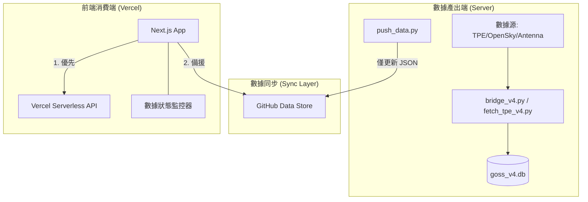

# TPE GOSS v4.1 架構翻修計畫

## 📋 問題背後的原因 (Root Cause)

經過深度調查，發現目前系統的核心痛點如下：

1.  **「自殺式」數據同步**：`push_to_github.py` 每分鐘執行時會執行 `git reset --hard`，導致任何在伺服器上修改的代碼（包括新 API 路由）被反覆刪除。
2.  **API 遷移斷層**：4/11 的遷移日誌顯示已完成 API 遷移，但實際代碼庫中 API 路由遺失，導致前端被迫退回讀取舊 CSV。
3.  **編碼亂碼**：桃園機場官網資料 (CP950) 在處理過程中損壞，造成網頁出現亂碼。
4.  **依賴鏈過長**：資料流為 `SQLite -> Python -> JSON -> GitHub -> CDN -> Frontend`，中間任何一環出錯，數據就會停留在數天前。

---

## 🛠️ 翻修目標 (GOSS 4.1)

1.  **數據代碼分離**：確保數據更新不會破壞代碼穩定性。
2.  **API 正位**：重建遺失的 3 個核心 API 路由，前端全面棄用 CSV。
3.  **數據透明化**：前端增加「實時健康檢查」面板，一眼看出數據是否新鮮。
4.  **編碼標準化**：徹底解決 Big5/CP950 亂碼問題。

---

## 📐 建議架構圖 (Data Flow v4.1)

---

## 🏗️ 詳細實施步驟

### 第一階段：穩定後端環境 (Stabilization)

#### 1. [MODIFY] [push_to_github.py](file:///c:/Users/Xin_Zhi/Desktop/google_ai/tpe-goss/goss-v4/push_to_github.py)
*   **關鍵動作**：刪除 `git reset --hard` 及 `git fetch` 邏輯。
*   **原因**：數據同步腳本不應該有權限重置你的整個開發代碼庫。

#### 2. [MODIFY] [fetch_tpe_v4.py](file:///c:/Users/Xin_Zhi/Desktop/google_ai/tpe-goss/goss-v4/fetch_tpe_v4.py)
*   **關鍵動作**：修正解碼邏輯，確保 `requests.get().content.decode('cp950', 'replace')` 始終輸出乾淨的 UTF-8。

### 第二階段：重建 API 層 (API Restoration)

#### 3. [NEW] [/app/api/schedule-data/route.ts](file:///c:/Users/Xin_Zhi/Desktop/google_ai/tpe-goss/app/api/schedule-data/route.ts)
*   **功能**：從 `goss_v4.db` 讀取 `flight_schedule` 表，取代舊的 CSV 導出。
*   **支援參數**：`type=arr`, `type=dep`。

#### 4. [NEW] [/app/api/gate-data/route.ts](file:///c:/Users/Xin_Zhi/Desktop/google_ai/tpe-goss/app/api/gate-data/route.ts)
*   **功能**：提供特定登機門的即時航班看板。

#### 5. [NEW] [/app/api/map-data/route.ts](file:///c:/Users/Xin_Zhi/Desktop/google_ai/tpe-goss/app/api/map-data/route.ts)
*   **功能**：為地圖頁面提供座標與狀態數據。

### 第三階段：前端功能遷移 (Frontend Migration)

#### 6. [MODIFY] [app/outbound/page.tsx](file:///c:/Users/Xin_Zhi/Desktop/google_ai/tpe-goss/app/outbound/page.tsx)
*   **關鍵動作**：移除 `CSV_URL`，改為 `useEffect` 內 fetch `/api/schedule-data?type=dep`。

#### 7. [MODIFY] [app/schedule/page.tsx](file:///c:/Users/Xin_Zhi/Desktop/google_ai/tpe-goss/app/schedule/page.tsx)
*   **關鍵動作**：同上，全面切換至資料庫 API。

### 第四階段：監控與容錯 (Monitoring)

#### 8. [NEW] [components/DataStatusPanel.tsx](file:///c:/Users/Xin_Zhi/Desktop/google_ai/tpe-goss/components/DataStatusPanel.tsx)
*   **功能**：在所有頁面底部或頂部顯示一個微型指示燈。
    *   🟢 正常 (最後更新 < 2 min)
    *   🟡 延遲 (最後更新 2-10 min)
    *   🔴 故障 (最後更新 > 10 min)

---

## 🚦 驗證計畫

### 自動化測試
1.  **API 壓力測試**：確保 `api_server_fixed.py` 能併發處理前端請求。
2.  **數據一致性檢查**：比較資料庫中的紀錄數與 `live_data.json` 中的紀錄數是否一致。

### 手動驗證
1.  **部署驗證**：在 Vercel 部署後，確認 Network tab 中不再出現請求 Google Sheets 的記錄。
2.  **亂碼驗證**：確認飛機型號（如「A333 已到」）顯示正確，無特殊字元。

---

## 💡 開放性問題

1.  **資料庫訪問**：由於網站部署在 Vercel，如果你的 SQLite 資料庫在本地伺服器，目前的 API 路由是透過代理轉發還是直接讀取本地檔案？（這決定了 API 路由的撰寫方式）。
2.  **GOSS 4.1 資料夾**：是否真的需要建立新目錄？
    *   **建議**：不需要新建，只需執行 `git branch goss-v4.1` 並在該分支進行重構，成功後合併回 `main`。這樣能保留所有歷史紀錄。
