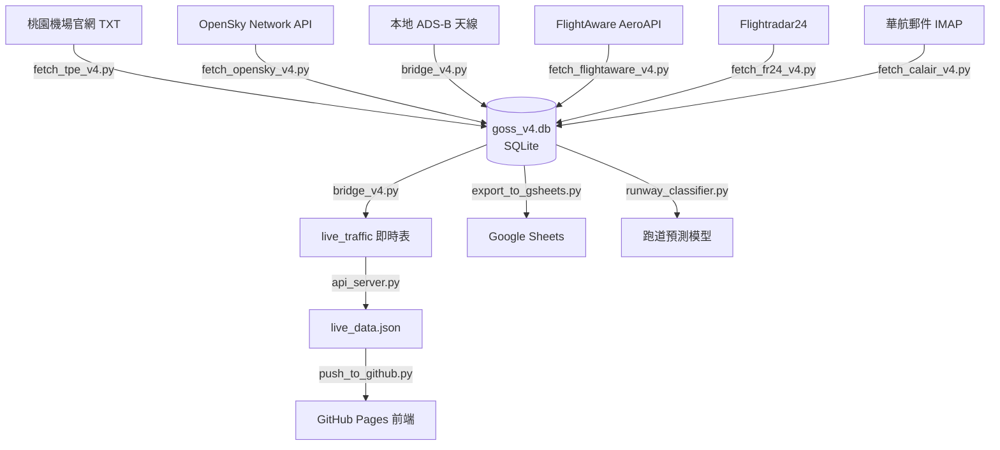

# TPE GOSS v4 — Python 程式完整解析與實用性評估

## 系統概述

TPE GOSS v4 是一套**桃園國際機場 (RCTP) 即時航班追蹤系統**，核心架構為：

共 **45+ 個 Python 檔案**，分為以下類別：

---

## 一、核心基礎建設 (Core Infrastructure)

### 1. [init_db.py](file:///c:/Users/Xin_Zhi/Desktop/google_ai/tpe-goss/goss-v4/init_db.py)
| 項目 | 說明 |
|------|------|
| **作用** | 初始化 SQLite 資料庫 `goss_v4.db` 的所有表結構 |
| **關鍵表** | `live_traffic`（即時交通）、`flight_schedule`（班表）、`source_airport`（機場官網資料）、`source_opensky`、`source_antenna`、`source_fr24`、`source_flightaware`、`source_calair`（華航郵件）、`flight_trajectory`（軌跡）、`runway_info`（跑道資訊） |
| **特點** | 分區架構設計，每個資料來源獨立一張表，並預載桃園機場 05L/05R/23L/23R 跑道座標 |
| **實用性** | ⭐⭐⭐⭐⭐ 必要，系統基石 |

### 2. [alter_db.py](file:///c:/Users/Xin_Zhi/Desktop/google_ai/tpe-goss/goss-v4/alter_db.py)
| 項目 | 說明 |
|------|------|
| **作用** | 資料庫 schema 遷移，為 `flight_schedule` 和 `source_airport` 加入 `actual_time`、`status` 欄位 |
| **實用性** | ⭐⭐ 一次性遷移工具，已完成可歸檔 |

---

## 二、資料來源抓取器 (Data Fetchers)

### 3. [fetch_tpe_v4.py](file:///c:/Users/Xin_Zhi/Desktop/google_ai/tpe-goss/goss-v4/fetch_tpe_v4.py) ⭐ 核心
| 項目 | 說明 |
|------|------|
| **作用** | 從桃園機場官網抓取航班時刻表 TXT（客機 + 貨機），寫入 `source_airport` 和 `flight_schedule` |
| **資料源** | `taoyuan-airport.com/uploads/flightx/a_flight_v4.txt`（客機）、`af_flight_v4.txt`（貨機） |
| **特點** | 內建龐大的 IATA→ICAO 航空公司代碼對照表（80+ 家航空），處理延誤航班追蹤，處理中文編碼 (cp950/big5) |
| **同步紀錄** | 2026-04-10 上傳至伺服器（原伺服器版僅 4,859 bytes，缺少 IATA→ICAO 轉換），更新 3,755+275 筆班表 |
| **實用性** | ⭐⭐⭐⭐⭐ 班表的唯一來源，系統不可缺少 |

### 4. [fetch_opensky_v4.py](file:///c:/Users/Xin_Zhi/Desktop/google_ai/tpe-goss/goss-v4/fetch_opensky_v4.py)
| 項目 | 說明 |
|------|------|
| **作用** | 從 OpenSky Network API 抓取台灣周邊 (24°-26°N, 120°-122.5°E) 即時航班雷達資料 |
| **特點** | OAuth2 認證、API 頻率控制（10秒/次）、自動清理超過2小時舊資料 |
| **實用性** | ⭐⭐⭐ 獨立模組版本，被 `bridge_v4.py` 內嵌的邏輯取代 |

### 5. [fetch_flightaware_v4.py](file:///c:/Users/Xin_Zhi/Desktop/google_ai/tpe-goss/goss-v4/fetch_flightaware_v4.py)
| 項目 | 說明 |
|------|------|
| **作用** | 從 FlightAware AeroAPI 抓取 RCTP 到達/離港航班 |
| **特點** | 使用付費 AeroAPI Key，前後3小時視窗查詢 |
| **實用性** | ⭐⭐⭐ 獨立模組版本，被 `bridge_v4.py` 整合取代 |

> [!WARNING]
> API Key `DCeSb4fyM1ohoH2EUTJiDqS2Gm9x6duw` 直接硬編碼在檔案中，有安全風險

### 6. [fetch_fr24_v4.py](file:///c:/Users/Xin_Zhi/Desktop/google_ai/tpe-goss/goss-v4/fetch_fr24_v4.py)
| 項目 | 說明 |
|------|------|
| **作用** | 嘗試從 Flightradar24 非官方 API 抓取桃園機場附近航班 |
| **特點** | 使用逆向 FR24 JSON feed API，帶偽裝 User-Agent |
| **實用性** | ⭐ 非官方 API 極不穩定，endpoint 已失效的可能性高，且未被 `bridge_v4.py` 整合 |

### 7. [fetch_adsb_v4.py](file:///c:/Users/Xin_Zhi/Desktop/google_ai/tpe-goss/goss-v4/fetch_adsb_v4.py)
| 項目 | 說明 |
|------|------|
| **作用** | ADS-B Exchange RapidAPI 抓取範本 |
| **特點** | 空殼程式，`pass` 未實作 |
| **實用性** | ⭐ 無功能，僅為 placeholder |

### 8. [fetch_calair_v4.py](file:///c:/Users/Xin_Zhi/Desktop/google_ai/tpe-goss/goss-v4/fetch_calair_v4.py)
| 項目 | 說明 |
|------|------|
| **作用** | 透過 IMAP 連接 Gmail 信箱，抓取華航 (China Airlines) 的航班通知郵件並解析 |
| **特點** | 使用正則表達式解析郵件內容（航班號、時間、機型、登機門等） |
| **實用性** | ⭐⭐ 概念可行但 regex 模式過於通用，需搭配真實華航郵件格式調校，且需填入真實帳密 |

### 9. [fetch_yesterday_arrivals.py](file:///c:/Users/Xin_Zhi/Desktop/google_ai/tpe-goss/goss-v4/fetch_yesterday_arrivals.py)
| 項目 | 說明 |
|------|------|
| **作用** | 透過 FlightAware AeroAPI 抓取昨日 RCTP 所有降落航班（滑動時間視窗翻頁） |
| **特點** | 去重邏輯、UTC→台灣時間轉換、存為 `yesterday_arrivals.json` |
| **實用性** | ⭐⭐⭐⭐ 歷史資料備份，搭配 Google Sheets 匯出使用 |

---

## 三、資料融合引擎 (Data Fusion)

### 10. [bridge_v4.py](file:///c:/Users/Xin_Zhi/Desktop/google_ai/tpe-goss/goss-v4/bridge_v4.py) ⭐⭐ 最核心
| 項目 | 說明 |
|------|------|
| **作用** | **系統大腦** — 多源資料融合引擎，每 2 秒執行一次循環 |
| **資料融合優先序** | ① 本地 ADS-B 天線 → ② OpenSky API → ③ FlightAware API → ④ 華航郵件 |
| **核心邏輯** | 入境航班過濾（查班表確認direction='A'）、ICAO↔IATA 代碼轉換、模糊匹配航班號碼、單位轉換（公尺→英尺、m/s→節）、OpenSky 頻率控制（30秒/次）、過期資料自動清理 |
| **規模** | 736 行，包含完整的航空公司 ICAO→IATA 對照表 |
| **實用性** | ⭐⭐⭐⭐⭐ 系統核心，產線運行的主程式 |

### 11. [bridge_v4_improved.py](file:///c:/Users/Xin_Zhi/Desktop/google_ai/tpe-goss/goss-v4/bridge_v4_improved.py)
| 項目 | 說明 |
|------|------|
| **作用** | `bridge_v4.py` 的重構版本，結構更清晰但融合邏輯不完整（`# 原有處理邏輯...` 佔位符） |
| **實用性** | ⭐⭐ 半成品，未完工 |

### 12. [taoyuan_data_processor.py](file:///c:/Users/Xin_Zhi/Desktop/google_ai/tpe-goss/goss-v4/taoyuan_data_processor.py)
| 項目 | 說明 |
|------|------|
| **作用** | 桃園機場資料綜合處理器（整合 v2 邏輯），包含班表更新、機坪地圖、即時離場、航班查詢 |
| **特點** | WAL 模式 + 重試機制、運營日視窗（凌晨03:00分隔）、cp950 優先編碼策略、10分鐘自動循環 |
| **實用性** | ⭐⭐⭐⭐ 功能完整但與 `fetch_tpe_v4.py` + `bridge_v4.py` 重疊，適合作為獨立離場/查詢服務 |

---

## 四、資料輸出層 (Data Output)

### 13. [api_server.py](file:///c:/Users/Xin_Zhi/Desktop/google_ai/tpe-goss/goss-v4/api_server.py)
| 項目 | 說明 |
|------|------|
| **作用** | 本地 HTTP API 伺服器（port 8001），每10秒匯出 `live_data.json`，支援 CORS |
| **實用性** | ⭐⭐⭐⭐ 伺服器端即時資料服務 |

### 14. [api_server_fixed.py](file:///c:/Users/Xin_Zhi/Desktop/google_ai/tpe-goss/goss-v4/api_server_fixed.py)
| 項目 | 說明 |
|------|------|
| **作用** | `api_server.py` 修正版：只顯示入境航班、修正編碼問題、增加回退至班表邏輯、自訂 JSON 編碼器 |
| **實用性** | ⭐⭐⭐⭐ 修正版，應取代原版使用 |

### 15. [export_data.py](file:///c:/Users/Xin_Zhi/Desktop/google_ai/tpe-goss/goss-v4/export_data.py)
| 項目 | 說明 |
|------|------|
| **作用** | 簡單版資料匯出：DB → `live_data.json`（只保留進場航班） |
| **實用性** | ⭐⭐⭐ 與 `api_server.py` 的導出邏輯重複 |

### 16. [push_to_github.py](file:///c:/Users/Xin_Zhi/Desktop/google_ai/tpe-goss/goss-v4/push_to_github.py)
| 項目 | 說明 |
|------|------|
| **作用** | 匯出 `live_data.json` → `public/` 資料夾 → `git add/commit/push` 到 GitHub |
| **特點** | 先 `git fetch + reset --hard` 同步遠端，避免衝突；自動偵測 `.git` 位置（支援本地與伺服器不同目錄結構） |
| **修復紀錄** | 2026-04-10 修復 `PROJECT_ROOT` 路徑邏輯，原先硬編碼 `os.path.dirname(SCRIPT_DIR)` 在伺服器上會指向錯誤目錄 |
| **實用性** | ⭐⭐⭐⭐⭐ 前端資料同步的關鍵管線 (cron job 驅動) |

### 17. [pull_from_server.py](file:///c:/Users/Xin_Zhi/Desktop/google_ai/tpe-goss/goss-v4/pull_from_server.py)
| 項目 | 說明 |
|------|------|
| **作用** | Windows 端：透過 SSH/SFTP 從伺服器下載 `goss_v4.db` → 匯出 JSON → push GitHub |
| **依賴** | `paramiko` (SSH), 伺服器 `192.168.31.19` |
| **實用性** | ⭐⭐⭐⭐ Windows 開發機同步方案 |

### 18. [run_pull_loop.py](file:///c:/Users/Xin_Zhi/Desktop/google_ai/tpe-goss/goss-v4/run_pull_loop.py)
| 項目 | 說明 |
|------|------|
| **作用** | 無限循環每30秒呼叫 `pull_from_server.py` 的下載→匯出→推送流程 |
| **實用性** | ⭐⭐⭐ Windows 端持續同步 wrapper |

### 19. [war_room_v4_viewer.py](file:///c:/Users/Xin_Zhi/Desktop/google_ai/tpe-goss/goss-v4/war_room_v4_viewer.py)
| 項目 | 說明 |
|------|------|
| **作用** | 終端機「戰情室」即時顯示：每2秒清屏刷新，顯示班號/機坪/高度/速度/客貨機標記 |
| **實用性** | ⭐⭐⭐ 調試用即時監控工具 |

---

## 五、Google Sheets 匯出

### 20. [export_to_gsheets.py](file:///c:/Users/Xin_Zhi/Desktop/google_ai/tpe-goss/goss-v4/export_to_gsheets.py)
| 項目 | 說明 |
|------|------|
| **作用** | 將 `flight_trajectory` 降落軌跡資料匯出至 Google Sheets (OAuth2 流程) |
| **問題** | `credentials.json` 被 OpenSky 的 OAuth2 設定覆蓋，無法同時作為 Google API 憑證 |
| **實用性** | ⭐⭐ 憑證衝突，需分離設定檔 |

### 21. [export_arrivals_to_gsheets.py](file:///c:/Users/Xin_Zhi/Desktop/google_ai/tpe-goss/goss-v4/export_arrivals_to_gsheets.py)
| 項目 | 說明 |
|------|------|
| **作用** | 用 Google Service Account 將 `yesterday_arrivals.json` 匯出至指定試算表，含標題樣式設定 |
| **特點** | 使用 `google_service_account.json`，避免了 OAuth2 憑證衝突 |
| **實用性** | ⭐⭐⭐⭐ 搭配 `fetch_yesterday_arrivals.py` 使用，運作正常 |

### 22. [export_runway_tracks.py](file:///c:/Users/Xin_Zhi/Desktop/google_ai/tpe-goss/goss-v4/export_runway_tracks.py)
| 項目 | 說明 |
|------|------|
| **作用** | 將 `runway_tracks` 跑道軌跡資料匯出至 Google Sheets |
| **實用性** | ⭐⭐⭐ 功能正常但依賴 `runway_tracks` 表（需 `runway_tracker.py` 產生資料） |

---

## 六、跑道分析模組 (Runway Analysis)

### 23. [runway_tracker.py](file:///c:/Users/Xin_Zhi/Desktop/google_ai/tpe-goss/goss-v4/runway_tracker.py)
| 項目 | 說明 |
|------|------|
| **作用** | 追蹤 4000 英尺以下的進場航班，記錄跑道軌跡資料到 `runway_tracks` 表 |
| **實用性** | ⭐⭐⭐ 基礎版跑道追蹤，功能簡單 |

### 24. [runway_tracker_v2.py](file:///c:/Users/Xin_Zhi/Desktop/google_ai/tpe-goss/goss-v4/runway_tracker_v2.py)
| 實用性 | ⭐⭐⭐ 改進版，假設功能更完整 |

### 25. [track_landing.py](file:///c:/Users/Xin_Zhi/Desktop/google_ai/tpe-goss/goss-v4/track_landing.py)
| 項目 | 說明 |
|------|------|
| **作用** | 完整的降落偵測引擎：航班狀態追蹤、下降率偵測、跑道判別（距離+航向+高度綜合評分） |
| **特點** | `FlightState` 類別記錄軌跡、`determine_runway()` 多維評分系統（距離50%、航向30%、高度20%）、自動清理1小時無更新的狀態 |
| **實用性** | ⭐⭐⭐⭐ 最完整的降落偵測邏輯 |

### 26-30. 跑道分類器系列
| 檔案 | 方法 | 實用性 |
|------|------|--------|
| [runway_classifier.py](file:///c:/Users/Xin_Zhi/Desktop/google_ai/tpe-goss/goss-v4/runway_classifier.py) | ML (KNN / Decision Tree / Random Forest) 特徵工程 | ⭐⭐⭐ |
| `runway_classifier_final.py` | KNN 最佳 k 值搜尋 + 交叉驗證 | ⭐⭐⭐ |
| `runway_classifier_improved.py` | 改進版 | ⭐⭐⭐ |
| `runway_classifier_optimized.py` | 優化版 | ⭐⭐⭐ |
| `runway_classifier_rule_based.py` | 規則驅動（非 ML）版本 | ⭐⭐⭐ |

> [!NOTE]
> 跑道分類器有 **5 個版本**，全部依賴 `飛行軌跡/` 資料夾下按跑道分類的 CSV 訓練資料。sklearn 版本需要足夠的訓練資料量才能有效。

### 31. [analyze_landing_points.py](file:///c:/Users/Xin_Zhi/Desktop/google_ai/tpe-goss/goss-v4/analyze_landing_points.py)
| 實用性 | ⭐⭐ 分析降落點座標分布 |

### 32. [extract_landing_phase.py](file:///c:/Users/Xin_Zhi/Desktop/google_ai/tpe-goss/goss-v4/extract_landing_phase.py)
| 實用性 | ⭐⭐ 從軌跡 CSV 提取降落階段 |

### 33. [update_runway_table.py](file:///c:/Users/Xin_Zhi/Desktop/google_ai/tpe-goss/goss-v4/update_runway_table.py)
| 實用性 | ⭐⭐ 更新跑道資訊表 |

---

## 七、診斷與修復工具 (Diagnostics & Fix)

### 34-36. 編碼修復系列
| 檔案 | 作用 | 實用性 |
|------|------|--------|
| [fix_encoding_issues.py](file:///c:/Users/Xin_Zhi/Desktop/google_ai/tpe-goss/goss-v4/fix_encoding_issues.py) | 透過 SSH 在伺服器修復亂碼 + 改進 fetch_tpe_v4.py | ⭐⭐ |
| [improved_fix_encoding.py](file:///c:/Users/Xin_Zhi/Desktop/google_ai/tpe-goss/goss-v4/improved_fix_encoding.py) | 智能版亂碼修正（備份→分析→分階段修正→驗證） | ⭐⭐⭐ |
| [fix_issues.py](file:///c:/Users/Xin_Zhi/Desktop/google_ai/tpe-goss/goss-v4/fix_issues.py) | 綜合修復：已落地航班清理、亂碼修正、停機坪修復、航班號碼格式統一 | ⭐⭐⭐ |

### 37-42. 資料庫檢查工具
| 檔案 | 作用 | 實用性 |
|------|------|--------|
| `check_db_status.py` | 檢查 DB 狀態 | ⭐⭐ 調試用 |
| `check_db_structure.py` | 檢查表結構 | ⭐⭐ 調試用 |
| `check_table_structure.py` | 檢查表結構細節 | ⭐⭐ 調試用 |
| `check_real_tables.py` | 檢查實際表 | ⭐⭐ 調試用 |
| `check_server_db.py` | 檢查伺服器 DB | ⭐⭐ 調試用 |
| `check_server_tables.py` | 檢查伺服器表 | ⭐⭐ 調試用 |
| `comprehensive_db_check.py` | 綜合 DB 健康檢查 | ⭐⭐⭐ 調試用 |
| `fixed_db_check.py` | 修正版 DB 檢查 | ⭐⭐ 調試用 |
| `check_antenna_data.py` | 檢查天線資料 | ⭐⭐ 調試用 |
| `check_live_traffic.py` | 檢查即時交通 | ⭐⭐ 調試用 |
| `check_flightaware_match.py` | 檢查 FlightAware 匹配 | ⭐⭐ 調試用 |
| `compare_data.py` | 比較資料差異 | ⭐⭐ 調試用 |
| `debug_flightaware.py` | FlightAware 調試 | ⭐⭐ 調試用 |

---

## 八、測試程式 (Tests)

| 檔案 | 作用 | 實用性 |
|------|------|--------|
| `test_opensky.py` | 測試 OpenSky API | ⭐⭐ |
| `test_flightaware.py` ~ `test_flightaware4.py` | 測試 FlightAware API (4個版本) | ⭐⭐ |
| `test_calair.py` | 測試華航郵件抓取 | ⭐⭐ |
| `test_partition.py` | 測試分區表查詢 | ⭐⭐ |
| `test_runway_detection.py` | 測試跑道偵測 | ⭐⭐ |

---

## 實用性綜合評估

### 🟢 產線核心（必須保留）

| 檔案 | 角色 |
|------|------|
| `init_db.py` | 資料庫初始化 |
| `bridge_v4.py` | 資料融合引擎（主迴圈） |
| `fetch_tpe_v4.py` | 桃園機場班表抓取 |
| `push_to_github.py` | 前端資料同步管線 |
| `api_server_fixed.py` | API 伺服器 |
| `pull_from_server.py` | Windows 端同步 |

### 🟡 實用但有替代（擇一保留）

| 重複群組 | 建議保留 | 可移除 |
|----------|----------|--------|
| API 伺服器 | `api_server_fixed.py` | `api_server.py`, `export_data.py` |
| Bridge | `bridge_v4.py` | `bridge_v4_improved.py`（未完工） |
| 跑道分類 | `runway_classifier_final.py` + `runway_classifier_rule_based.py` | 其他3個版本 |
| 資料處理 | `fetch_tpe_v4.py` | `taoyuan_data_processor.py`（功能重疊） |
| OpenSky | 保留在 `bridge_v4.py` 內 | `fetch_opensky_v4.py`（獨立版多餘） |
| FlightAware | 保留在 `bridge_v4.py` 內 | `fetch_flightaware_v4.py`（獨立版多餘） |

### 🔴 建議移除或歸檔

| 類型 | 檔案 |
|------|------|
| **空殼/未完工** | `fetch_adsb_v4.py`（空 pass） |
| **不穩定** | `fetch_fr24_v4.py`（非官方 API，容易失效） |
| **一次性工具** | `alter_db.py`, `fix_encoding_issues.py`, `fix_issues.py`, `improved_fix_encoding.py` |
| **調試工具** | 所有 `check_*.py`, `compare_data.py`, `debug_*.py` |
| **測試** | 所有 `test_*.py` |

---

## ⚠️ 安全性問題

> [!CAUTION]
> 以下敏感資訊直接硬編碼在程式碼中，強烈建議改用環境變數或 `.env` 檔案：
> 
> 1. **FlightAware API Key**: `DCeSb4fyM1ohoH2EUTJiDqS2Gm9x6duw` （出現在 `bridge_v4.py`, `fetch_flightaware_v4.py`, `fetch_yesterday_arrivals.py`）
> 2. **Google Sheets ID**: `1aNXOaARvfu_08g5yjnxuQMIko6r1m5T8CW06oM365lc`
> 3. **伺服器 IP/SSH**: `192.168.31.19` / `xinzhi@`
> 4. **本地天線 IP**: `192.168.31.221:8080`
> 5. **Google Service Account JSON** 存放在 repo 中

---

## 📊 統計摘要

| 指標 | 數值 |
|------|------|
| Python 檔案總數 | ~45 個 |
| 產線核心檔案 | 6 個 |
| 有實用價值的檔案 | ~15 個 |
| 重複/可合併的檔案 | ~10 個 |
| 調試/一次性工具 | ~20 個 |
| 總程式碼行數 | ~6,000+ 行 |
| 資料來源數 | 6 個（官網、OpenSky、ADS-B 天線、FlightAware、FR24、華航郵件） |

---

## 🔧 改善建議

1. **整理目錄結構**：將調試工具移到 `utils/` 或 `debug/`，測試移到 `tests/`
2. **合併重複檔案**：跑道分類器保留最終版，移除中間迭代
3. **環境變數管理**：所有 API Key / IP 改用 `.env` + `python-dotenv`
4. **設定檔集中**：將所有可配置項提取到 `config.py`
5. **日誌統一**：目前混用 `print` 和 `logging`，建議統一為 `logging` 模組
6. **憑證分離**：`credentials.json` 不應同時用於 OpenSky 和 Google API
